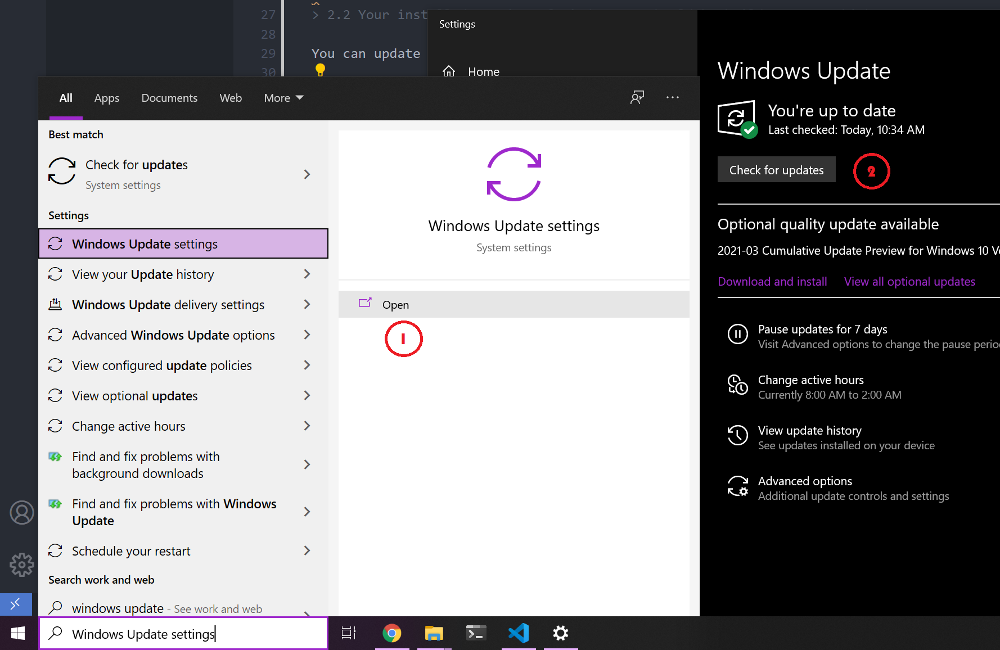
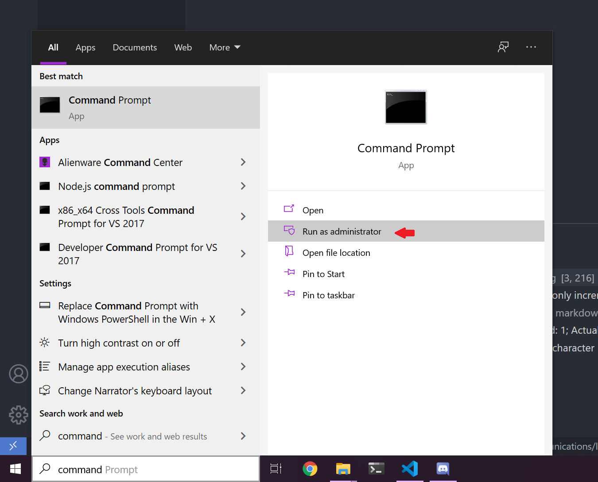
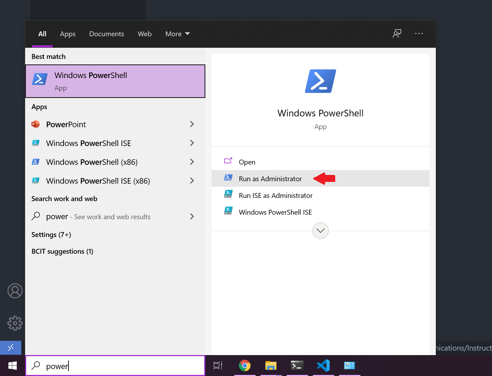
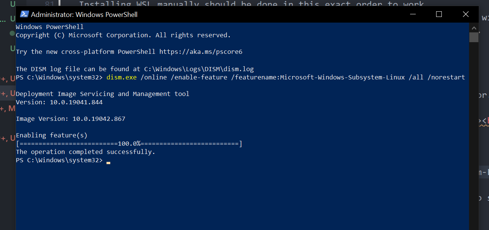

# Table of Contents

1. [Introduction](#Intro)
    1. Is this for you?
    2. Prerequisites
2. [Simplified Version](#method1)
    1. Join the Windows Insider Program
    2. Update your Windows
    3. Run the install command through CMD
3. [Manual Version](#method2)
    1. Enable the Windows Subsystem for Linux
    2. Check requirements for running WSL 2
    3. Enable Virtual Machine feature
    4. Download the Linux kernel update package
    5. Set WSL 2 as your default version
    6. Install your Linux distribution of choice

___
### 1. Introduction
___

The Windows Subsystem for Linux allows us run a supported version of Linux in a windows environment. Although this would be a limited version of Linux and we won't be able to run any GUI interfaces such as Gnome or Xfce, it still supports all of the command line based apps such as MySQL, vim, Nano etc.

> 1.1 Is this for you?

If you are a Linux user who is just starting to use Windows or even a developer who needs to constantly go back and forth between a Mac and Windows device, having Linux installed on your system could help you do the command line tasks easier and faster.

> 1.2 Prerequisites

You need to have the following ready before proceeding to the installation process:

- Have Windows 10 installed
    - Update the windows for simplified installation (Optional) 
    - Update the windows for WSL 2 (Optional)

- Have access to admin privileges 
- Access to Microsoft Store
- Access to internet

In the next section we will go over installing WSL.

___
### 2. Simplified version 
___

> 2.1 Join the [Windows Insider Program](https://insider.windows.com/getting-started).

Linux Subsystem was originally created by Microsoft to run android apps on Windows. This project was shutdown and Microsoft imported this module as a feature for Windows 10. 

In order to install WSL via the simplified method, you need to signup for the Insider Program to access Beta features that are under tests to be fully implemented on Windows.

The signup process is well-explained in the Microsoft's website.

> 2.2 Your installed version of Windows 10 should be build 20262 or higher.

You can update your windows from Startup menu by searching "windows update" and clicking "check for updates" button.

  

>2.3 Enter the following command in your Terminal to begin the installation.

After the following requirements are in place, open the windows command prompt (CMD) with administrator privileges from the Startup menu .

  

    wsl --install

This command will automatically install Linux Ubuntu as the default distribution. If you want to install a different distribution, you can add a flag to the same command as following:

    wsl --install -d /Distribution Name/

Your WSL should be ready after the restart. Open the installed Linux app and it should finalize the setup automatically.

  

___
### 3. Install WSL on Windows 10 manually
___

Installing WSL manually should be done in this exact order to work.
Please note Installing WSL using this method could be done on any version of windows as it doesn't depend on the Beta testing Program and it will install WSL1 instead of WSL2 by default.

> 3.1 Enable the Windows Subsystem for Linux

To enable this module for windows we need to use the Windows PowerShell.
Search "powershell" in the Startup menu and run PowerShell as an administrator.

  

**Enter the following command to enable Linux Subsystem on your device.**

    dism.exe /online /enable-feature /featurename:Microsoft-Windows-Subsystem-Linux /all /norestart 
    
 

  

If you want to keep using WSL1, You can restart your computer now and jump to section 6, otherwise, go to next section to get the proper windows update based on your computer structure.

> **3.2 Check requirements for running WSL 2**

In order to run WSL 2 you need to have a certain version of windows or higher based on your system architecture type.
To check your system type use the command prompt window from the last step and enter the following command:

    wmic OS get OSArchitecture

Then you can check the version of your windows using the command below in CMD:

    ver

Now according to the table below, check if your windows needs to be updated before switching to WSL2.

| System Type | Min Version  | Min Build   |
|-------------|--------------|-------------|
| X64         | Version 1903 | Build 18362 |
| ARM64       | Version 2004 | Build 19041 |

**- Please note builds lower than 18362 do not support WSL 2.**

> **3.3 Enable Virtual Machine feature**

Using the same powershell window from the last steps, run the following command to enable the Windows Hyper V feature to run the Linux as a virtual machine.
