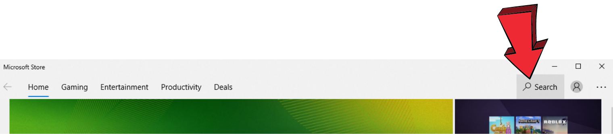
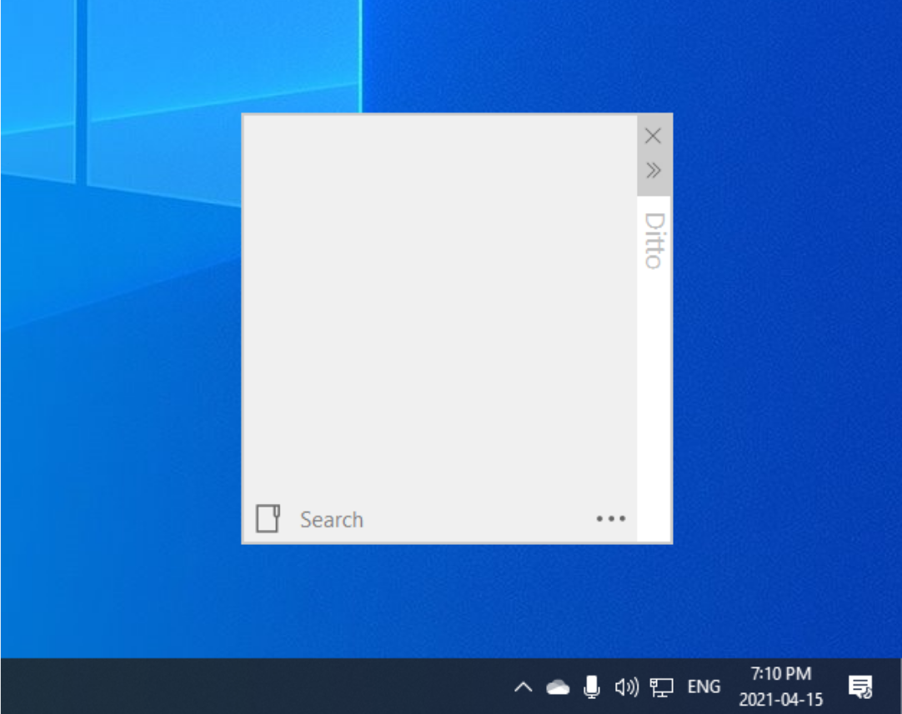
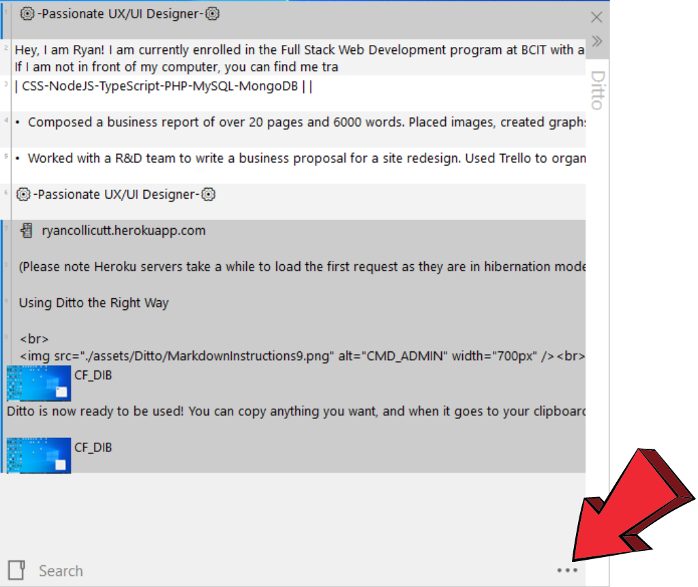

# Table of Contents

1. [Introduction](#Intro)
    1. Is this for you?
    2. Windows Clipboard History or Ditto
    3. Prerequisites
2. [Installing the Ditto Clipboard App](#part1)
    1.  Install Ditto from the Microsoft Store App
    2.  Setting Up Ditto for Use  
3. [Exploring Ditto](#part2)
    1.  Copying Multiple Ditto Objects
    2.  Keyboard Shortcuts
    3.  Increasing Ditto Storage

___
## 1. Introduction
___

 
Copy and paste are two of the most used keyboard commands on any computer. Windows OS takes that one step further by introducing an app that saves your copy/paste history. This gives you the ability to use multiple data pieces from different locations all at one time, or recover data that was deleted by copying again. We can take advantage of this to make our daily use of computers a lot easier.
  

> ### 1.1 Is this for you?

 
Have you ever overwritten what was on your clipboard by accident, only to realize there was no way to go back and all that you had was lost? Or maybe there was something you thought was wasn't needed, but a week later you find yourself needing that specific piece of data again? Or maybe you are looking for a way to copy things you like and have them be permanently saved to your computer. In this guide, I will show you how to install and setup Ditto Clipboard on your Windows OS operating system.
  

> ### 1.2 Windows Clipboard History or Ditto

 

Windows already has a built in function for saving clipboard history, but it maxes out on 25 items and is wiped when your computer restarts. Ditto is superior, allowing you to copy multiple items at the same time, and record almost unlimited amount of clipboard items, through as many restarts as you wish.
  

> ### 1.3 Prerequisites

 
You need to have the following before proceeding with installing Ditto:

- A computer with Windows 10 installed
- A keyboard and mouse 
  

___
## 2. Installing the Ditto App
___

 

> ### 2.1 Install Ditto from the Microsoft Store App
 
Microsoft store is one of those features that comes automatically installed on Windows 10. It gives us direct access to applications produced by Microsoft that do not come installed on the computer.   

1) Navigate to the bottom left of your desktop. On the navbar, click on the start button.    

 

2) Scroll down until you find "Microsoft Store". Click on it.   

  

3) In the top right of the Microsoft Store App, click on search.

  

4) Type in "Ditto" and press on the Ditto icon that appears.   **Note: If the dropdown menu does not appear, click on the magnifying glass, and select Ditto from the list.**

 
 

5) Click on the blue install button to install Ditto, then move onto the next part.   

  

Ditto is now installed! We can now move forward to figuring out how to use it.

 

> ### 2.2  Setting Up Ditto for Use
 

Ditto is essentially ready to be used the moment you install it, however, there are a few things we will want to do to make sure we know how to use it. Let us add Ditto to our task bar for more efficient use.  

1) To add Ditto to your task bar, click on the three dots next to the launch button, and select "pin to taskbar".  

  

2) Click on the Ditto icon on the taskbar to open it. 

 
  

3) Nothing should happen right away. Look on the right side of the taskbar. There is an upward arrow that is filled with different apps running behind the scenes. Click on the arrow to open it, and click on the Ditto icon.

 
  

4) Now we will see what Ditto looks like. Its a small window that is mostly white, and should be empty because we have not copied anything to our clipboard yet. 

 
  

5) Now you can copy anything you want, and when it goes to your clipboard, it also goes to Ditto! This is what it should look like after you copy some text, and then copy an image.

 
  

Ditto is now ready to be used. The information is stored into ditto as objects. You can interact with the objects by right clicking, or left clicking and pressing ctrl + c.
  
___
## 3. Using Ditto the Right Way
___

 
In this section, I will guide you on how to set up Ditto so you can get the most out of it. When Ditto captures data from your clipboard, it saves it into an object. You can see the objects in the previous figure.
   

> ### 3.1 Copying Multiple Ditto Objects

 
After saving a few items to your clipboard, your Ditto should have a few objects inside. I will guide you through manipulating them in a couple of ways.  

**_tip: if you drag the right hand side of Ditto, you can drag the screen around._ _If you grab the bottom right hand side, you can make the window larger. If you grab the objects and drag them, they will turn into files. Use ctrl + c to copy the data within._**

 

1) The first way to work with these objects is the most useful. We are going to copy the objects that we want. Select multiple objects in Ditto using ctrl + left click. You will notice a thin blue highlight that is applied when you click on the object. This means the object has been interacted with. from here we can simply hit ctrl + c. We notice that by copying the objects to our clipboard, they do not get re-copied to Ditto. Ditto is not redundant in that way.

 
  

Copying multiple objects at once has its benefits. Now that we can do that, let us move forward to our keyboard shortcuts.

> ### 3.2 Keyboard Shortcuts

 
Now I will show you that we can change the keyboard shortcuts to allow us to work with Ditto more effectively. 
  

1) Click on the 3 dots in the bottom right of the Ditto software. This will open a menu, at the top of the menu, click options.

 
  

2) This leads to an options page. Navigate to keyboard shortcuts. Here, you can set your start command and your custom copy and paste commands. These work in places where regular ctrl + c and ctrl + v commands are not available. When you are done, press ok at the bottom of the screen.

 
  

Now that I have shown you keyboard shortcuts, we will go over bonus options.

 

> ### 3.3 Increasing Ditto Storage

 
In this section, I will go over how to change the storage in Ditto of Ditto Objects. Sometimes we may need t ostore things for a long time, or, forever. These are both possible with Ditto.
  

1) Click on the three dots in the bottom right corner of the Ditto software again. Click options at the top of the menu that pops up. Once in the options screen again, navigate to the general tab.

 

2) Once you are on the general tab, you can now change the amount of copies that are saved, or remove a maximum amount entirely. Click inside the box that says 500, and change it to the amount you want.

 
  

When you are finished, you can close the options tab, and continue to use Ditto with the hot keys you chose in section [3.2](#part3.2). 

 

Remember, if you need to access the Ditto Objects, navigate to the bottom right hand side of your computer's nav bar, click the little up arrow, and click on the Ditto icon.

  
Congratulations! You have now installed Ditto and are capable of using it on the fly! You can follow these simple instructions on any computer that has windows 10. Next time you wish you could recall a piece of clipboard data from the past, you're going to wish you had Ditto installed!
