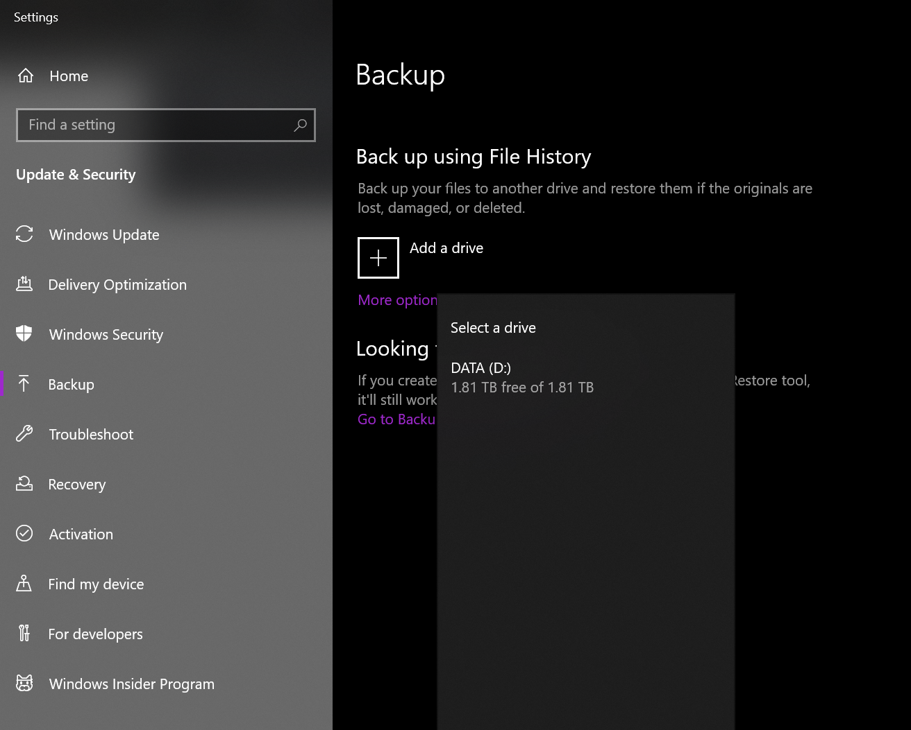
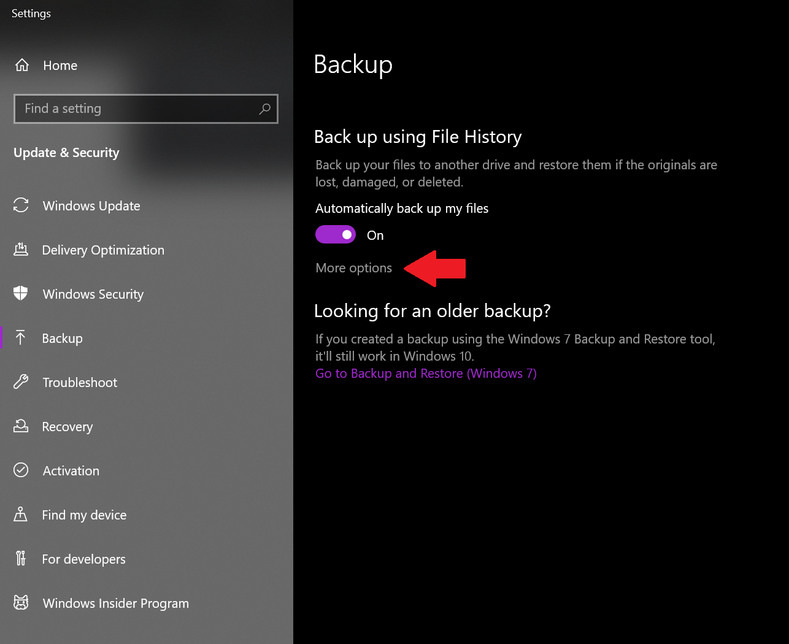
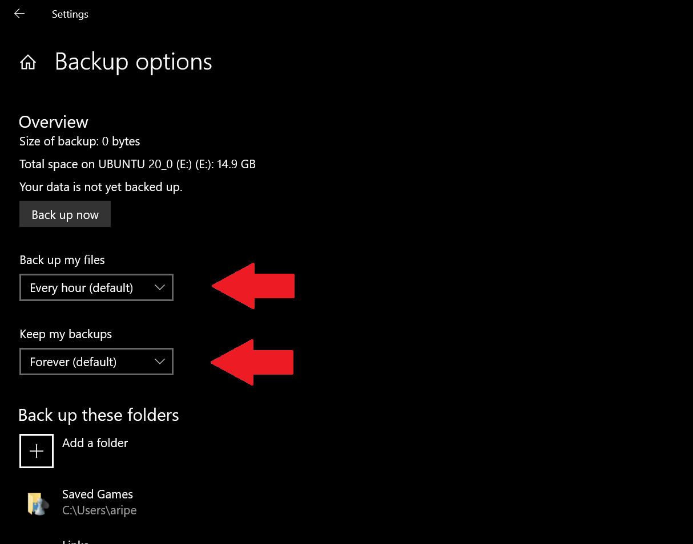
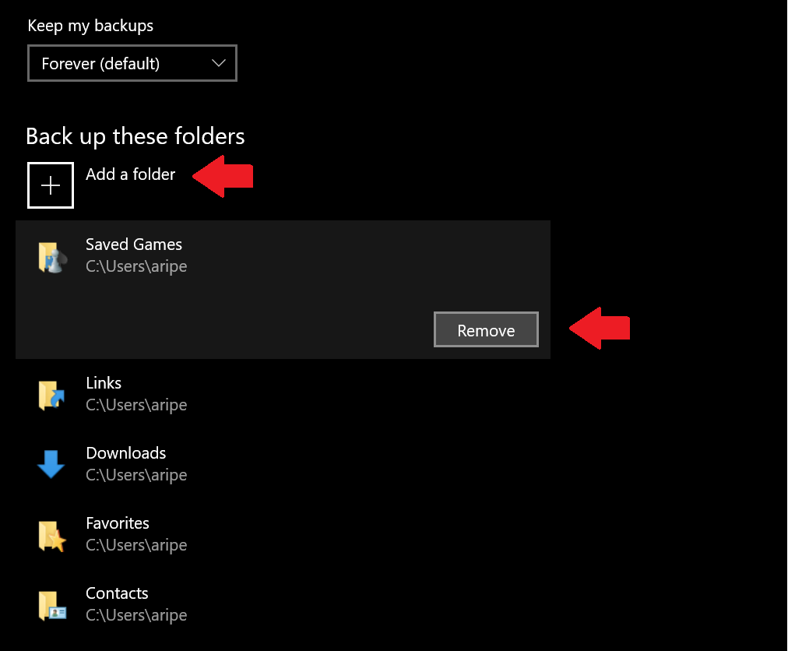
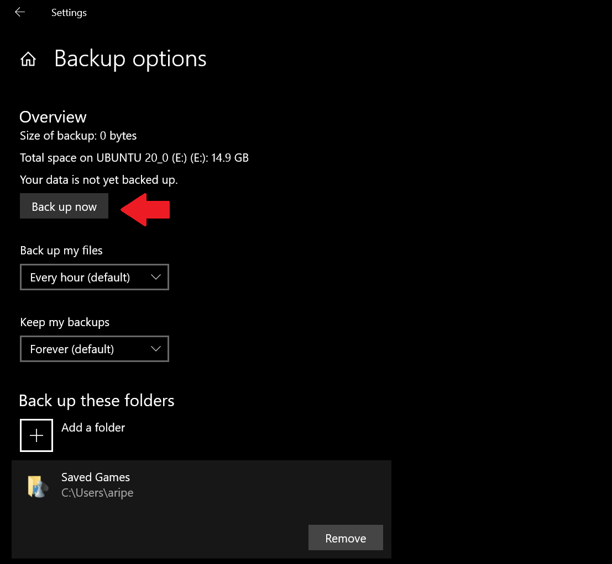
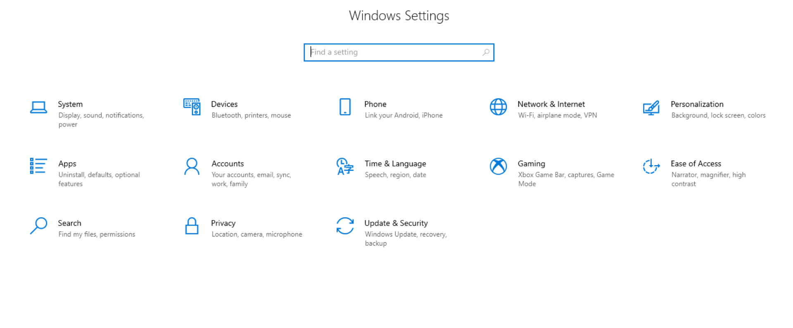
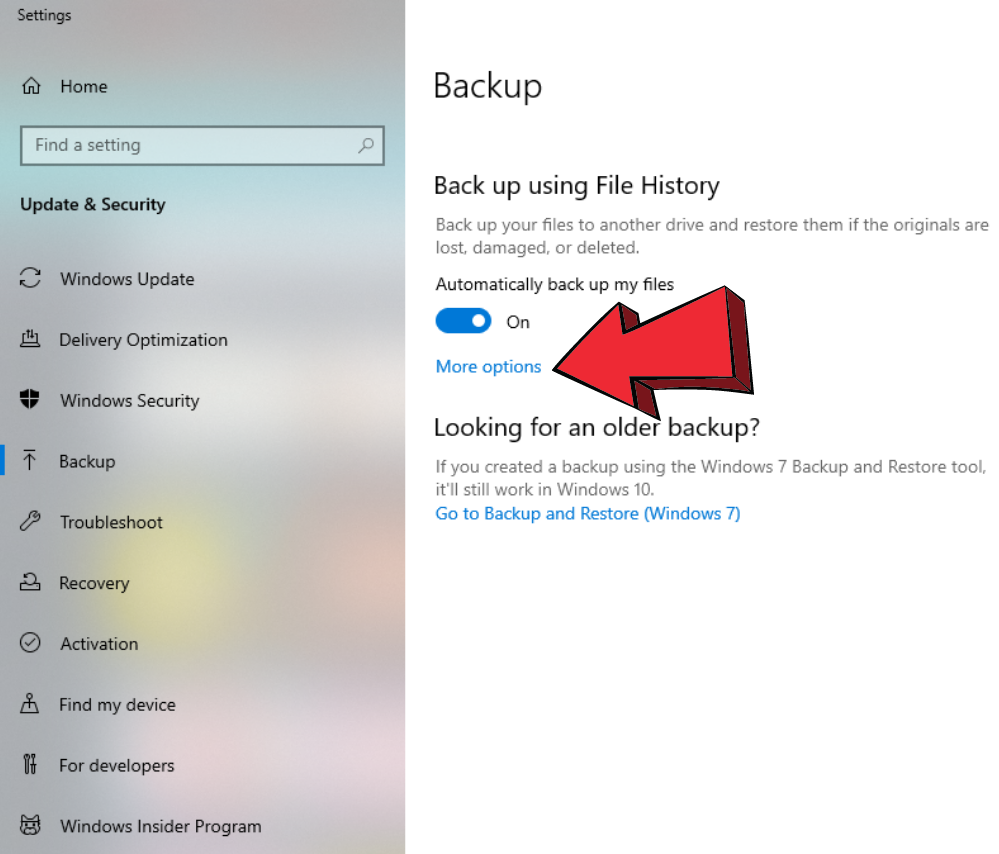
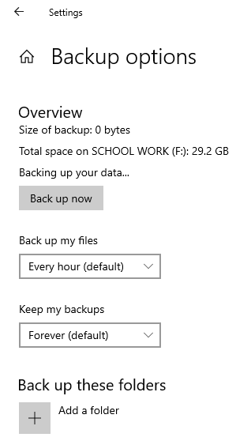
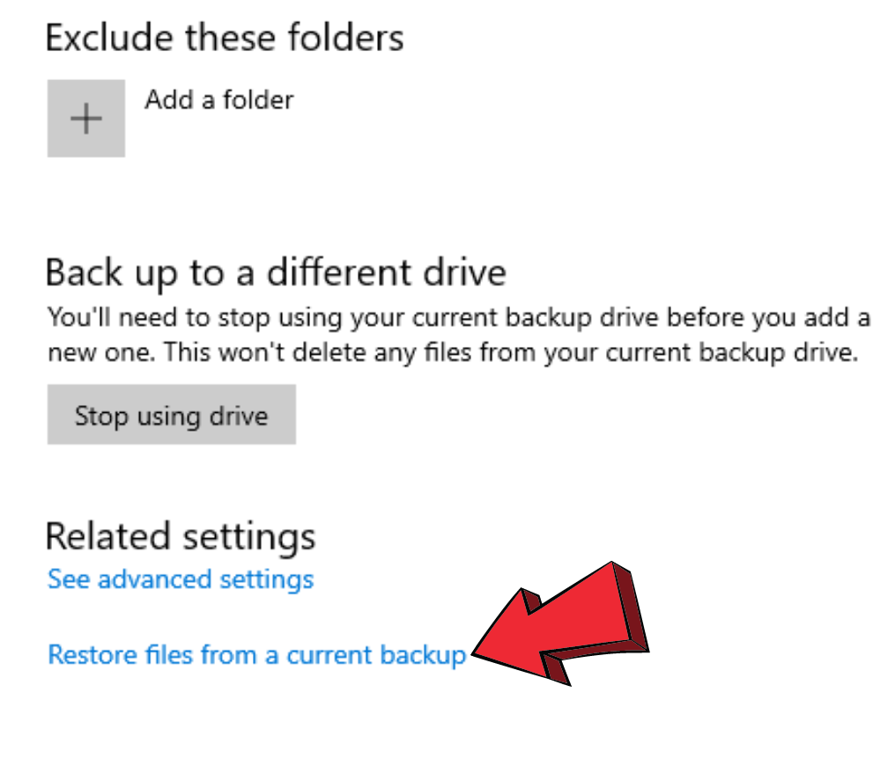
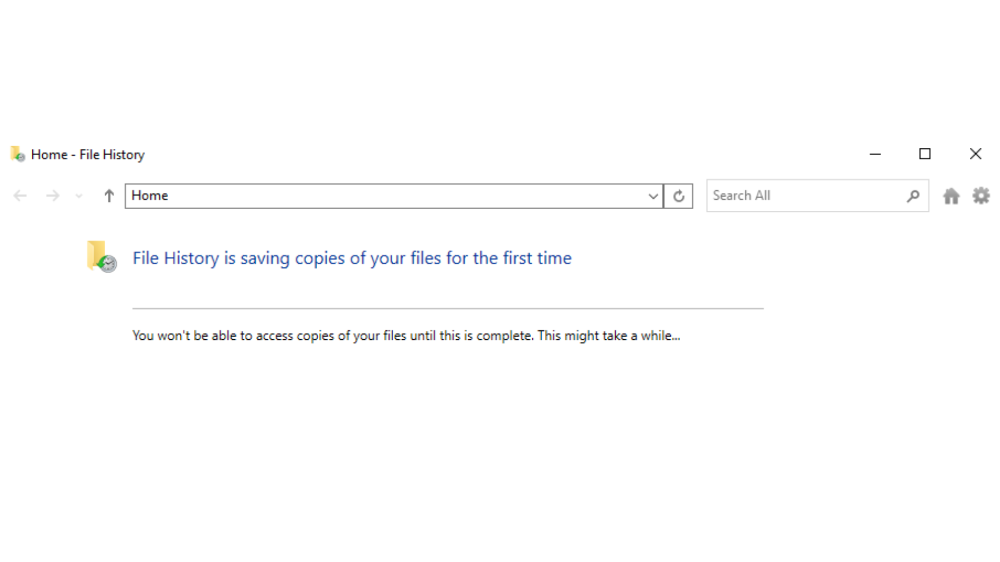

# Table of Contents

1. [Introduction](#Intro)
    1. Is this for you?
    2. Prerequisites
2. [Setup Windows File History](#part1)
    1. Enable Windows File History for your disk drive
    2. Set the backup configurations
    3. Manage your backup list
    4. Backup your files
3. [Restore files using Windows File History](#part2)
    1. Restore files from a current backup

___
## 1) Introduction
___

There are so many ways to backup your files on Windows. Today we will take a look at Windows File History which is a built-in feature in windows. Windows File History allows you to backup your files on a external storage device. We will be going through how to setup and create a backup and also restore that backup using Windows File History.

> ### 1.1 Is this for you?

No matter what your job is or how much information you have, you still need to regularly backup your data. In today's world, most of our documents and information is stored on our computers. If you are a Windows user who has important data on their computer, you would defiantly find this instruction helpful. creating a backup of your files regularly could prevent data loss disasters and keep you information safe from most possible dangers.

> ### 1.2 Prerequisites

You need to have the following ready before proceeding to the installation process:

- Windows 10
- Any type of external storage device to backup your files.

___
## 2) Setup Windows File History
___

To backup our files using Windows File history, first we need to select the drive as a destination of our backups. This device could be a USB storage or a local network; either way, it should be properly mapped and configured so it's recognizable by windows.

> ### 2.1 Enable Windows File History for your disk drive

1) First connect your external USB storage device to you system.

2) Go to **Settings > Update & Security > Backup**, then select _"Add a drive"_ under the _"Backup Using File History line"_. Assuming you have a backup drive attached, Windows shows a list of all the available locations. Choose the drive that you want to use for your backups.

 

- File History is now enabled. We can go ahead and customize the configurations.

> ### 2.2 Set the backup configurations

3) Navigate to the backup settings by clicking on "More options".

 

4) The first two sections that you need to modify are "Backup my files" and "Keep my backups". 

- The first one just simply changes the frequency of the backups on your system. You should change this based on how much you use your computer per day and also you should consider the hardware power on your system.

- The second field changes the time that File History keeps the backups; so, depending on this value you could keeps backups from weeks or months ago. Choose this option based on your storage capacity.

 

> ### 2.3 Manage your backup list

5) Next, you can add or remove folders to our backup watchlist manually. 

- Click on a folder name and select "Remove" to stop File History to create backups from that device.

- Click on "Add Files" to add a new folder to the backup list.

 

> ### 2.4 Backup your files

6) Now that you added your folders to the list, You can initiate the backup process by clicking on the "Backup now" button under the Overview section at the top.

 

Congratulations! You files are safe now!

___
## 3) Restore files using Windows File History
___

Now that our files have been backed up, what do we do if something goes wrong with them? After completing part 1, which may take several hours, you have access to your backup.

To restore our files using Windows File History, we need to have a backup that Windows File History has access to(you will have one after part 1). If configured correctly, Windows File History saves multiple copies of your files. This means if they become corrupted, you can restore a previous version. Depending on the configuration, Windows File History will either overwrite previous copies with the current version, or save a certain amount of copies for a certain amount of days. You can also configure how often Windows File History will save. 

> ### 3.1 Restore files from a backup

Having a current backup means Windows File History has 1 or more backups ready to go. If it only has 1 backup, it means there are no previous copies available. Either way, in this section, all we need is the current version. 

1) In the search bar on your navbar, type in "settings". Open up the app, and press backup.
    
 

2) In the search bar, type "backup", and click on the backup settings. You will be redirected to a different window. Click on more options to get to the next part. 

 

3) This will lead us to a page that has the following layout.

 

4) Scroll all the way to the bottom and click on the small blue link that says, "Restore files from current backup".

 

5) You will be taken to a screen where you can see the versions of files that you have available to you. Click on the version you want, and File History will prompt you. In this case, you want to click on the latest version. 

 

Once this is done, you have now restored the files that you needed to restore, were corrupted, or accidentally deleted. File History lets you save at intervals so you always have a latest copy of your files.

