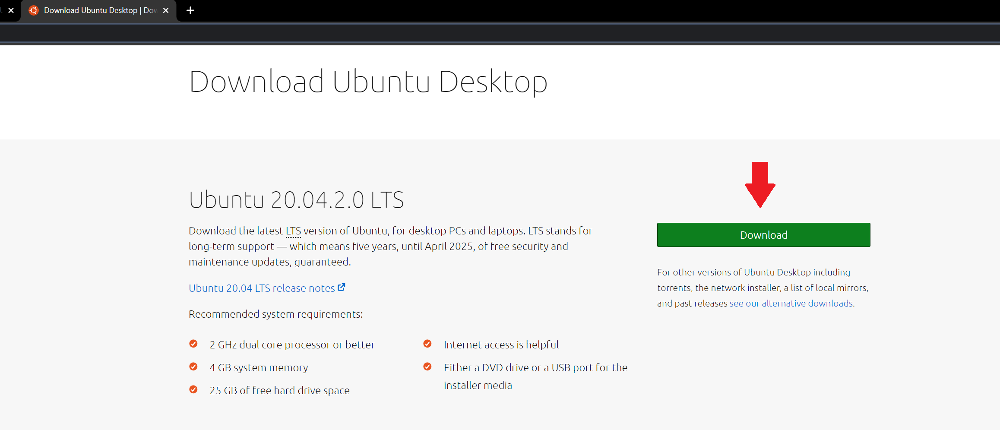
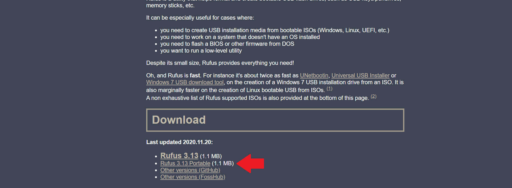
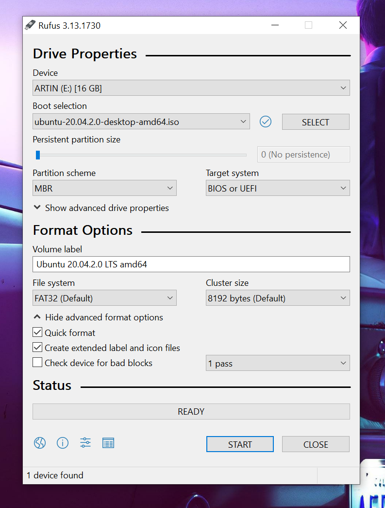
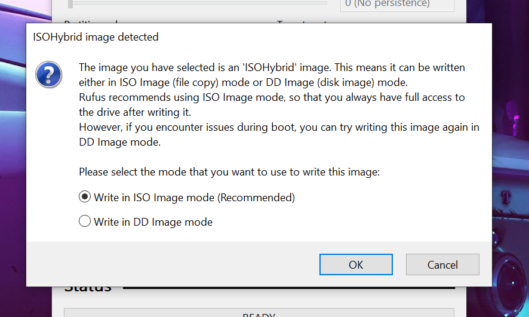
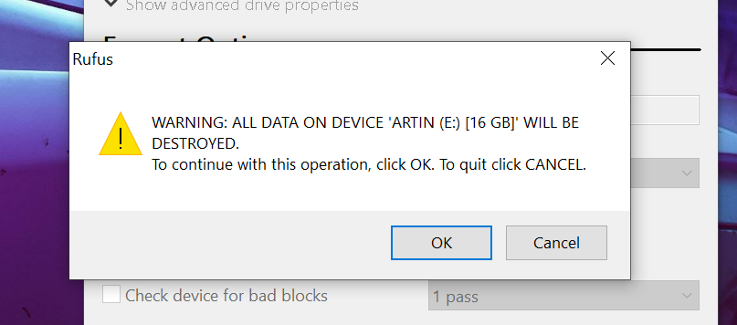
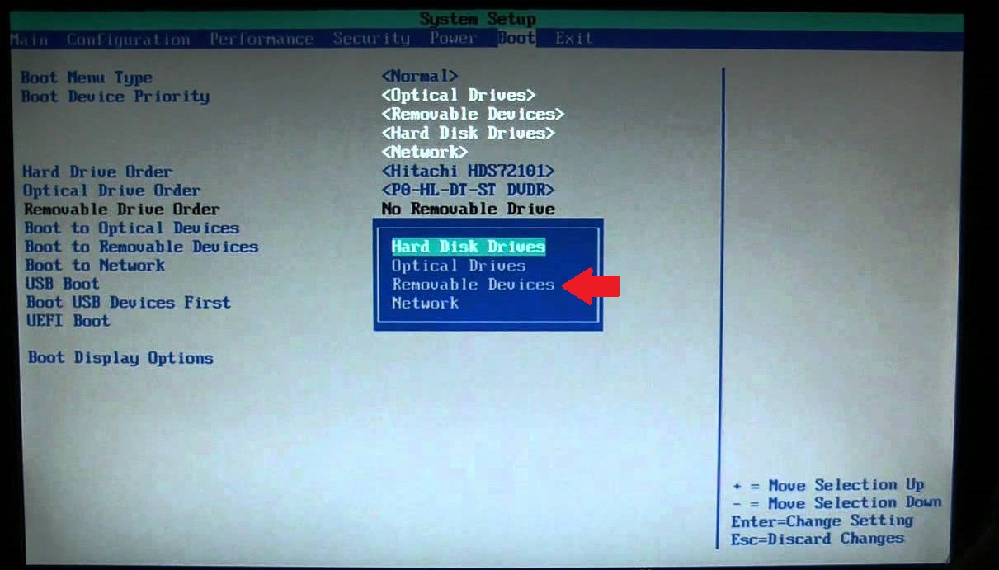
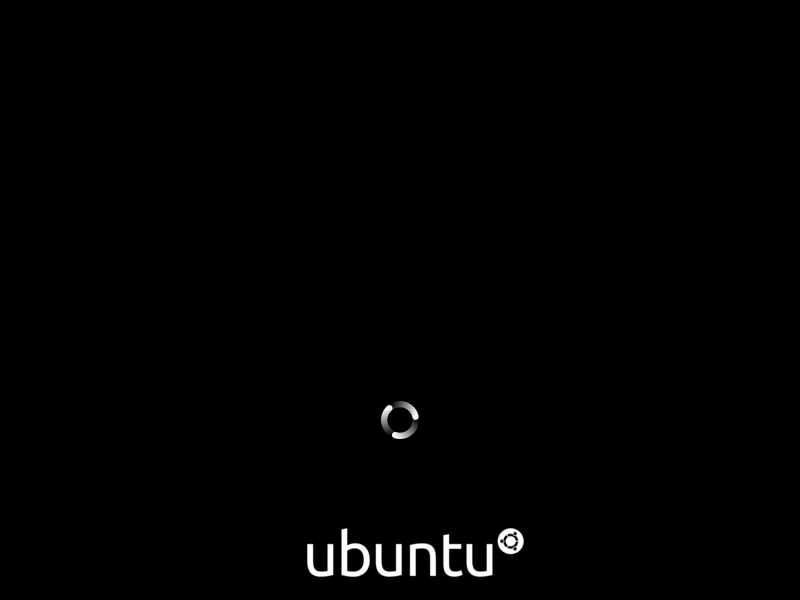

# Table of Contents

1. [Introduction](#Intro)
    1. Is this for you?
    2. Prerequisites
2. [Create an installation disk](#part1)
    1. Download the Linux Distribution of your Choice
    2. Download and install __Rufus__ to create a bootable installer
    3. Choose the USB drive and Installer file to create bootable USB. 
3. [Boot into the Linux installer](#part2)
    1. Change the boot order in motherboard's BIOS
    2. Boot from the USB drive to begin the Linux installation process.

___
## 1) Introduction
___

Linux is a very popular OS in the world. It has some benefits that makes it outstanding for different purposes. One of it's most important attributes is being super lightweight. this means we don't need a lot of storage an RAM to run a Linux system. We can take advantage of this and create an portable workstation using Linux.

> ### 1.1 Is this for you?

If you work in a IT department or you need to repair or install Linux regularly, you defiantly want to have a small portable installation media. Also, if you just want to install Linux on your system and you don't have a CD/DVD writer optical drive, you could use this instruction to create a bootable Linux installer USB.

> ### 1.2 Prerequisites

You need to have the following ready before proceeding to the installation process:

- A USB drive with at least 4Gb of storage.
- Have **Rufus** installed

___
## 2) Create an installation disk
___

> 2.1 Download the Linux Distribution of your Choice

In order to create a bootable installation disk, we need to choose a Linux distribution to install. You can download your desired Linux distribution in .iso format from their websites. You can find the websites simply by searching the distribution names in Google. I will be using Ubuntu in this instructions and this is a link to [Linux Ubuntu download](https://ubuntu.com/download/desktop) page.

1) Navigate to the Ubuntu download page and download the .iso file and save it on your pc.

  

> 2.2 Download and install __Rufus__ to create a bootable installer

There are so many software to use for creating a bootable media disk. But, I would suggest using this free app called [Rufus](https://rufus.ie/en_US/). Rufus is fast and efficient and also it has a portable version that we can use. Based on my experience, Rufus is a reliable and up to date media creator app with a good history.

To create a bootable USB drive, we need to download [Rufus](https://rufus.ie/en_US/). 

2) Navigate to the website and download the portable version.

  

3) After the download is finished, plug in the USB with smaller storage and open Rufus by double clicking on it. 

4) Select your USB drive in the first field and the Linux iso file in the second field.

5) Next, make sure you set the file system on FAT32 and the quick format box is checked under the advanced format options.

  

6) if you get the following pop ups, press "OK" to proceed (Any data on the USB device will be deleted).

  

**This pop up is just simply asking for the writing method which in our case is ISO image mode as we are using an .iso file.**

  

**This pop up is a WARNING before you format your USB drive. You will lose all the data on the memory stick after pressing OK**

Once the operation is completed you will get a notification sound.

___
## 3) Boot into the Linux installer
___

In this section I will guide you how to use the install media you created to begin the installing your Linux.
Installing operating systems needs to be initiated before your current OS is launched. The USB device that we created has a boot-loader file in it which allows the motherboard to launch our Linux installer right off the batch. In order to make this happen we need to change some settings on our motherboard.

> **3.1 Change the boot order in motherboard's BIOS**

Every motherboard company has a specific key for loading the BIOS settings. Some of the most common keys are F2 and F9 function key at top of your keyboard. Also, some companies use "delete" key as a shortcut to the boot sequence menu. 

You can search the model of your motherboard, look at the manual or just test and try to find the designated key. After you found the key, you can proceed to the next step.

1) Restart your computer and keep pressing the BIOS setting key.

If you press the right key at the right time, this is how most of BIOS settings would look like.

2) Find the settings regarding the boot device priority to set the "removable devices" (Some motherboard actually show the device name) as the first device to boot.

  

3) Use the legend on the bottom of the screen to **Save and Exit** from this settings.

Your computer should restart and you should see the Ubuntu Installer starting.

  

Congratulations your installer disk it's ready!
You can follow the same steps on any PC or laptop to repair or install your Linux.