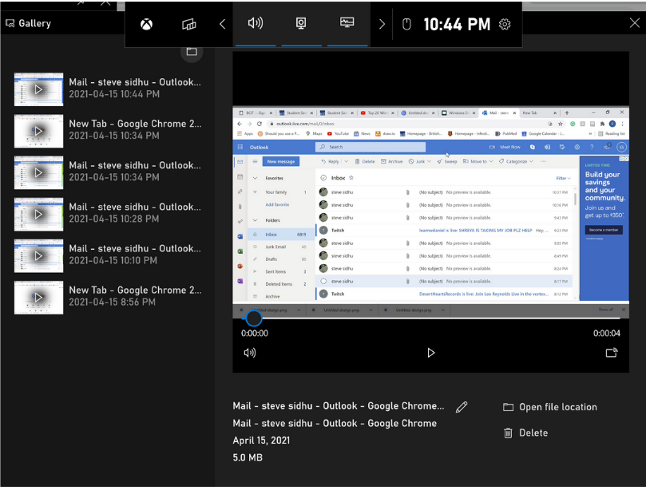

## Table of Contents

1. [Introduction](#Intro)
    1. Is this for you?
    2. Prerequisites

2. [Launch your "Xbox Game Bar" application](#Task1)
    1.  in the task bar, search for Xbox Game Bar 
    2.  Launch the game bar

3. [Screen Capture the desired clip](#Task2)
    1.  Find the capture window
    2.  Click the record button
    3.  Confirm th status of your recording
    4. Click the stop button to finish recording your clip
    5. click the pop-up notification
    6. Watch your recording

3. [Configure your Hot Key Settings](#Task3)
    1.  Go to task bar and search for "game bar setting"
    2.  Configure your hot key shortcut

4. [Conclusion](#outro)

 

___
## Introduction
___

These instructions will show you how to use Windows' built-in "Xbox Game Bar" application 
to launch, capture, and configure your first screen recording. The application makes recording your screen 
extremely easy. It's used to record absolutely anything displayed on your screen - not only specific to video games.  
 

>### Is This Guide for You?

 

This guide is created for beginner, intermediate and advanced users of the Windows Operating System. Only basic computer skills are
required for this step by step instruction set. There will be a great deal of visual graphics and explanations presented thoroughly throughout the
user documentation. No need to spend any money since the application is completely free to use and already comes pre installed on your 
Windows OS.

 

>### Prerequisites:

 

#### _To follow these instructions, you will need:_

- A computer with a Windows Operating System.
- A keyboard and mouse/trackpad attached to computer. 
- Basic knowledge working with a computer.

 

 

 
Task 1 - Launch your "Xbox Game Bar" application
 

 
 
The first step to launching your "Xbox Game Bar" application is to go down to the task bar and in the search field type in "game bar". You should see a best match appear for the "Xbox Game Bar", click on this to open the app. We will show you visually how to launch this app in a few simple steps. 

 
 

>1. Go to the task bar and within the search field type "Xbox Game Bar".

 

 

>2. Launch the app by clicking on the "Xbox Game Bar" application. 

  
  

 

---
**Note:** You can also launch Screen Recorder by pressing the hot key shortcut --> (Windows Logo Key + G) 

---

 

 

 
 

---

 
Task 2 -  Screen Capture the desired clip
 

 
 

Now that you have launched your Xbox Game Bar, you must find the capture window located in the top left corner of the interface. In the capture window you will find a record button, this is what you will click to video capture your screen. 
 
 

>1. Find the capture window in top left of your screen.

 

 

>2. Click the record button located near the middle of the capture window to start your recording.

  
  

 

>3. Confirm that your screen is successfully recording, indicated by the red recording button that should be located on the right side of your screen. 

 

 

>4. Once your done with your recording, Click the stop button, and your clip will be officially recorded. 

 

 

---
**Tip:** Once you stop the recording, get ready to click on the notification that will pop up. 

---

 

>5. Click on the "Game Clip Recorded" notification that appears to open up file explorer

 

 

>6. Here you can watch your recording from the file explorer, move your recording to a preferred folder, or delete your recording.

 

 

Task 3 -  Configure your Hot Key Settings
 

 
 

Upon successfully learning to capture your screen, you can now configure your hot key shortcut. By changing your hot key shortcut, your able to maximize your productivity and personalize your hot key shortcut to your liking.
 
 

>1. Go to the task bar and within the search field type "game bar settings". Click on the game bar settings app.

 

 

>2. Once you click on game bar settings, you'll be directed to a the settings page where you can adjust all sorts of xbox game bar settings. This includes changing the hot key shortcuts. You can also set hot key for recording or for taking a screenshot. 

  
  

 

 

# Conclusion

### Once you have changed your preferred hot key shortcut, you have completed the tutorial. Although the Xbox screen recorder is not the best recorder but it comes free and pre-installed with windows and does a decent job. When your in a pickle, this is a fantastic screen recorder to use.

 

# Glossary

## **Screen Capture**

### A screen capture is a digital recording of computer screen output, also known as a video screencast or a screen recording.

 

## **Windows OS (Operating System)**

### Windows is a desktop operating system developed by MIcrosoft. 

 

## **Interface**

###  the means by which interaction or communication is achieved at.

 

